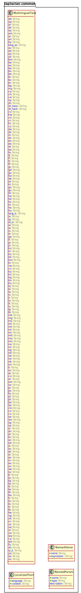

<!-- @head-content@ -->
# laplacian/common-model

Some value objects and mixins which can be applicable to any domain models.

<!-- @head-content@ -->

<!-- @toc@ -->
## Table of contents
1. [Usage](#usage)

1. [Schema model](#schema-model)

1. [Source list](#source-list)


<!-- @toc@ -->

<!-- @main-content@ -->
## Usage

Add the following entry to your project definition.
```yaml
project:
  models:
  - group: laplacian
    name: common-model
    version: 1.0.0
```


## Schema model


### Model overview

The following diagram summarizes the structure of the model:



### Entities

- [**Entity**](<./doc/entities/Entity.md>)
  エンティティ
- [**NamedParam**](<./doc/entities/NamedParam.md>)
  named_param
- [**NamedValue**](<./doc/entities/NamedValue.md>)
  named_value
- [**Property**](<./doc/entities/Property.md>)
  property
- [**PropertyMapping**](<./doc/entities/PropertyMapping.md>)
  property_mapping
- [**Query**](<./doc/entities/Query.md>)
  The queries from which all navigation originates.
- [**Relationship**](<./doc/entities/Relationship.md>)
  relationship
- [**ValueDomainType**](<./doc/entities/ValueDomainType.md>)
  value_domain_type
- [**ValueDomain**](<./doc/entities/ValueDomain.md>)
  value_domain
- [**ValueItem**](<./doc/entities/ValueItem.md>)
  value_item
- [**LocalizedText**](<./doc/entities/LocalizedText.md>)
  localized_text
- [**MultilingualText**](<./doc/entities/MultilingualText.md>)
  multilingual_text
- [**NamedParam**](<./doc/entities/NamedParam.md>)
  named_param
- [**NamedValue**](<./doc/entities/NamedValue.md>)
  named_value


## Source list


[model/project/language_code_list.yaml](<./model/project/language_code_list.yaml>)

[model/project/sources.yaml](<./model/project/sources.yaml>)

[model/project.yaml](<./model/project.yaml>)

[src/entities/localized_text.yaml](<./src/entities/localized_text.yaml>)

[src/entities/multilingual_text.yaml](<./src/entities/multilingual_text.yaml>)

[src/entities/named_param.yml](<./src/entities/named_param.yml>)

[src/entities/named_value.yml](<./src/entities/named_value.yml>)

[src/value_domain_types/language.yaml](<./src/value_domain_types/language.yaml>)

[template/src/entities/multilingual_text.yaml.hbs](<./template/src/entities/multilingual_text.yaml.hbs>)

[template/src/value_domain_types/language.yaml.hbs](<./template/src/value_domain_types/language.yaml.hbs>)


<!-- @main-content@ -->